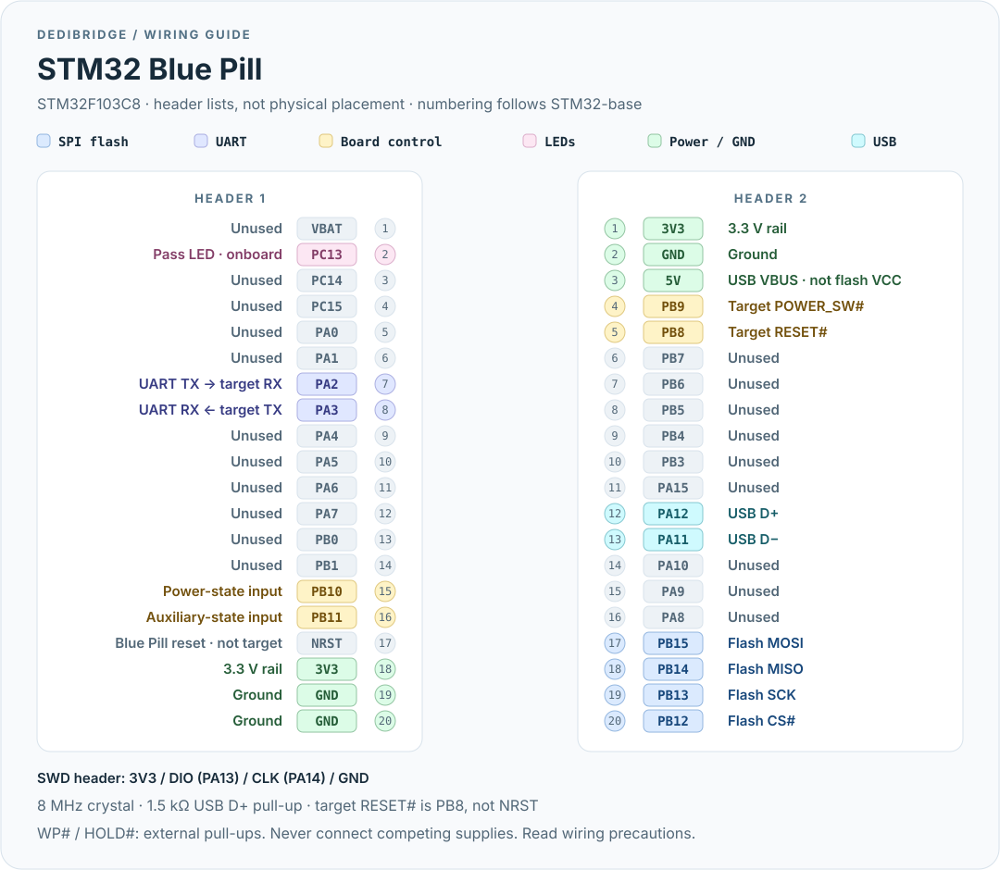

# STM32 Blue Pill

[← DediBridge](../../README.md) · [Pico](pico.md) · [CH32V307](ch32v307.md)

**Proof of concept** for the STM32F103C8 Blue Pill: full-speed USB,
SPI2 + DMA, single-lane flash. Uses the official **64 KiB flash / 20 KiB SRAM**
limits, not the unofficial 128 KiB sometimes found on clones.

## Pinout



The diagram lists each header independently using
[STM32-base's header numbering](https://stm32-base.org/boards/STM32F103C8T6-Blue-Pill.html);
it is **not a component-side placement drawing**. Use the board's GPIO labels
(`B12` = PB12, `A2` = PA2), not a guessed orientation. Clone layouts vary.

| Connection | MCU pin / board label |
|---|---|
| Flash CS# / SCK / MOSI / MISO | PB12 / PB13 / PB15 / PB14 |
| Flash WP# / HOLD# | External pull-ups; no MCU connection |
| UART TX → target RX / RX ← target TX | PA2 / PA3 (USART2) |
| Target RESET# / POWER_SW# | PB8 / PB9 |
| Target power-state / auxiliary-state inputs | PB10 / PB11 |
| Pass LED (onboard, active-low) | PC13 |
| Busy / Error LEDs | Not provided |
| USB D− / D+ (onboard connector) | PA11 / PA12 |
| Power / ground | 3.3 / G |

**RESET# to the target is PB8, not the Blue Pill's own `R`/NRST pin.**
[Read the wiring precautions](../wiring.md). PB10/PB11 have no internal pull-ups.
Do not power the Blue Pill through USB and an external 5 V supply simultaneously:
its 5 V header rail is connected directly to USB VBUS.

## Check the board

- Firmware expects an **8 MHz HSE crystal**.
- USB requires a proper **1.5 kΩ D+ pull-up**. Some Blue Pills have 10 kΩ or
  4.7 kΩ instead; replace an incorrect resistor before troubleshooting USB.
- Non-ST clone MCUs are common and are not qualified by this firmware.
- SPI2 runs at up to **18 MHz** with the 72 MHz system clock configuration.
- Firmware briefly drives D+ low at startup to force USB re-enumeration.

## Install firmware

Connect an ST-Link or another probe-rs-supported SWD probe to **DIO (PA13)**,
**CLK (PA14)** and **GND**, with the probe's voltage reference connected as its
manual requires. Keep BOOT0 low for normal flash boot.

```sh
cargo xtask flash stm32f103
```

This builds and flashes with `probe-rs-tools`. Alternatively, download
`dedi-stm32f103.elf` from a [release](https://github.com/ArthurHeymans/dedibridge/releases)
or [CI artifact](https://github.com/ArthurHeymans/dedibridge/actions) and flash
it with probe-rs for `STM32F103C8`. See [building](../building.md).

Connect the onboard USB port and follow [usage](../usage.md). UART baud settings
must be between **550 and 2,250,000**; these limits are not sustained-throughput
guarantees. USB recovery and pin muxing still need hardware qualification.

## References

- [STM32-base Blue Pill pinout, schematic and board caveats](https://stm32-base.org/boards/STM32F103C8T6-Blue-Pill.html)
- [Firmware pin assignments](../../boards/stm32f103/src/main.rs)
- [Hardware validation checklist](../hardware-validation.md)
