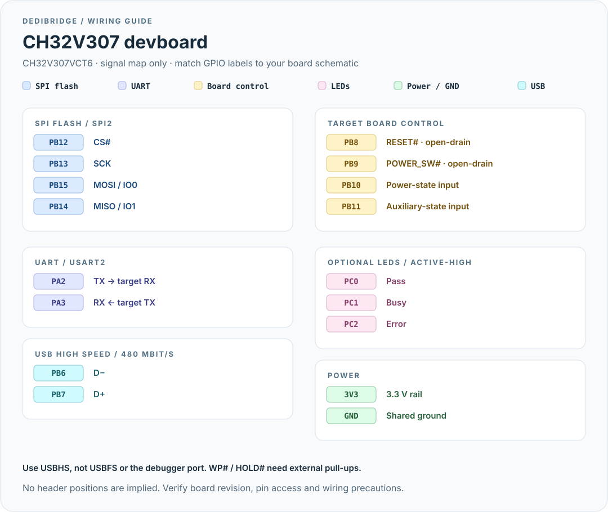

# CH32V307 devboard

[← DediBridge](../../README.md) · [Pico](pico.md) · [Blue Pill](blue-pill.md)

For **CH32V307VCT6** boards with the USBHS port exposed. SPI2 + DMA,
USB 2.0 high speed (480 Mbit/s), single-lane flash. A WCH-Link/debug probe is
needed to install firmware.

## Pinout



This is a **signal map, not a physical header layout**. CH32 devboards have
several layouts; match the GPIO labels on your board and its schematic. The
[WCH EVT-R1 schematic](https://github.com/openwch/ch32v307/blob/main/SCHPCB/CH32V307V-R1-1v0/SCH_PCB/CH32V307V-R1.pdf)
is a reference, not a guarantee that your board has that layout.

| Connection | MCU pin |
|---|---|
| Flash CS# / SCK / MOSI / MISO | PB12 / PB13 / PB15 / PB14 |
| Flash WP# / HOLD# | External pull-ups; no MCU connection |
| UART TX → target RX / RX ← target TX | PA2 / PA3 (USART2) |
| Target RESET# / POWER_SW# | PB8 / PB9 |
| Target power-state / auxiliary-state inputs | PB10 / PB11 |
| Pass / Busy / Error LEDs (active-high) | PC0 / PC1 / PC2 |
| USBHS D− / D+ | PB6 / PB7 |
| Power / ground | 3V3 / GND on the board |

**Use the USBHS connector, not USBFS or the debugger's USB port.** On the WCH
EVT-R1 reference board, P6 is USBHS; check the connector labeling on your
revision. PA11/PA12 belong to the other USB peripheral and are not used here.
The firmware requires a high-speed link; full-speed fallback descriptors are
not implemented.

[Read the wiring precautions](../wiring.md). PB8–PB11 are FT digital inputs in
the MCU datasheet, but check open-drain operation before connecting 5 V control
pull-ups; use level shifting otherwise. PB10/PB11 have no internal pull-ups.
Do not assume a devboard's onboard LEDs are wired to PC0–PC2; external LEDs
with series resistors can be used instead.

## Install firmware

Connect a compatible WCH-Link to the board's debug header, with a shared ground
and the required target voltage reference. Use your board/probe documentation
for the debug-header wiring.

```sh
rustup toolchain install nightly --component rust-src
cargo xtask flash ch32v307
```

This builds and flashes with `probe-rs-tools`. Alternatively, download
`dedi-ch32v307.elf` from a [release](https://github.com/ArthurHeymans/dedibridge/releases)
or [CI artifact](https://github.com/ArthurHeymans/dedibridge/actions) and flash
it with probe-rs for `CH32V307VCT6`. See [building](../building.md).

Then connect the board's USBHS port to the host and follow
[flashprog, UART and board-control usage](../usage.md).

## References

- [WCH board overview and schematic links](https://docs.zephyrproject.org/latest/boards/wch/ch32v307v_evt_r1/doc/index.html)
- [WCH CH32V30x evaluation-board manual](https://www.wch.cn/uploads/file/20220228/1646012640528497.pdf)
- [Firmware pin assignments](../../boards/ch32v307/src/main.rs)
- [Hardware validation checklist](../hardware-validation.md)
