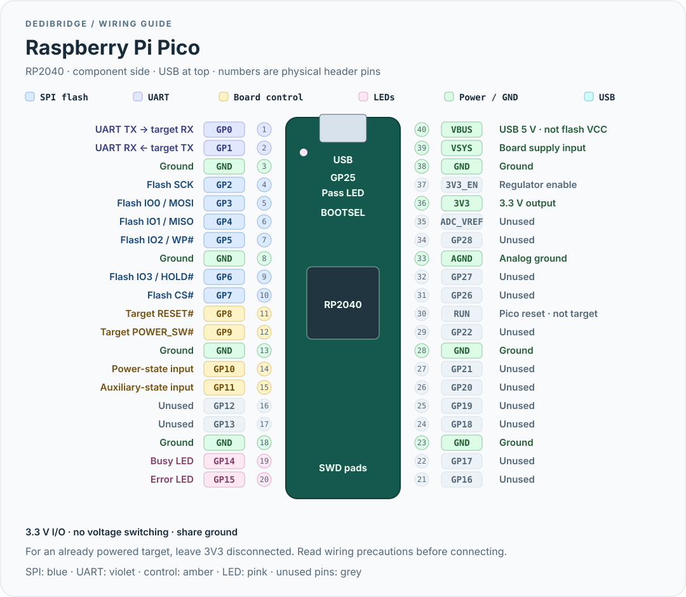

# Raspberry Pi Pico

[← DediBridge](../../README.md) · [CH32V307](ch32v307.md) · [Blue Pill](blue-pill.md)

The **original RP2040 Pico / Pico H**, not Pico W or Pico 2. Full-speed USB,
PIO + DMA flash engine, single/dual/quad reads. No debug probe is needed when
installing a UF2.

## Pinout



| Connection | GPIO | Physical pin |
|---|---|---|
| Flash SCK | GP2 | 4 |
| Flash IO0 / MOSI | GP3 | 5 |
| Flash IO1 / MISO | GP4 | 6 |
| Flash IO2 / WP# | GP5 | 7 |
| Flash IO3 / HOLD# | GP6 | 9 |
| Flash CS# | GP7 | 10 |
| UART TX → target RX | GP0 | 1 |
| UART RX ← target TX | GP1 | 2 |
| Target RESET# / POWER_SW# | GP8 / GP9 | 11 / 12 |
| Target power-state / auxiliary-state inputs | GP10 / GP11 | 14 / 15 |
| Busy / Error LEDs (external, active-high) | GP14 / GP15 | 19 / 20 |
| Pass LED (onboard) | GP25 | — |
| 3.3 V output | 3V3(OUT) | 36 |
| Ground | GND | 3, 8, 13, 18, 23, 28, 33, 38 |

[Read the wiring precautions](../wiring.md). GP3–GP6 must stay consecutive for
the PIO engine. GPIO control inputs have no pull-ups; external LEDs need series
resistors. UART and board-control wiring is optional if you only need flash.

## Install firmware

1. Download `dedi-rp2040.uf2` from a [release](https://github.com/ArthurHeymans/dedibridge/releases)
   or the `dedibridge-firmware` [CI artifact](https://github.com/ArthurHeymans/dedibridge/actions).
2. Hold **BOOTSEL** while plugging in the USB cable.
3. Copy the UF2 to the `RPI-RP2` drive. The Pico reboots as the programmer.

To build a UF2 yourself, see [building](../building.md#firmware-downloads).
With a debug probe connected to the Pico's separate SWD pads (SWDIO, GND,
SWCLK):

```sh
cargo xtask flash rp2040
```

## Use it

```sh
flashprog -p dediprog --flash-name
flashprog -p dediprog:iomode=quad -r dump.bin
```

[UART and board control](../usage.md) can run alongside flashprog. USB is only
12 Mbit/s, so it is slower than a high-speed programmer. SPI defaults to 24 MHz
and is capped at 24 MHz. Writes/transceive remain single-lane. The retained
experimental QPI **read** path is not qualified end-to-end QPI programming.
Some opcodes select dual/quad modes independently of IO_MODE.

## References

- [Official Pico pinout](https://datasheets.raspberrypi.com/pico/Pico-R3-A4-Pinout.pdf)
- [Raspberry Pi board documentation](https://www.raspberrypi.com/documentation/microcontrollers/pico-series.html)
- [Firmware pin assignments](../../boards/rp2040/src/main.rs)
- [Hardware validation checklist](../hardware-validation.md)
